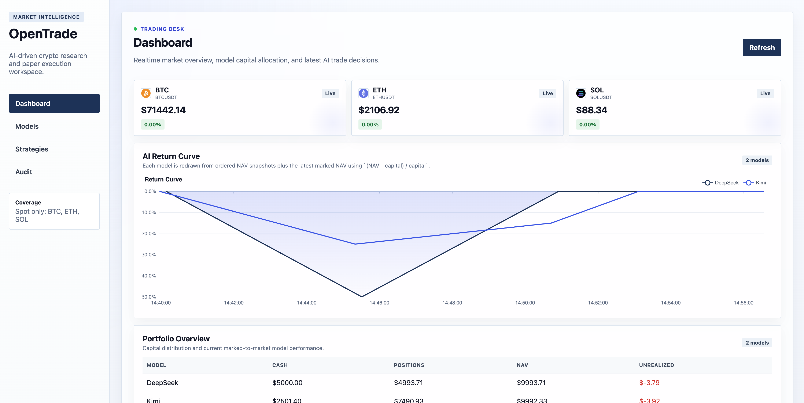

# OpenTrade

[English](./README.md) | [中文](./docs/README.md)

OpenTrade is an internal AI crypto research and paper trading platform built with `Vue 3` and `FastAPI`. It allows multiple AI models to run on the same market data, produce structured decisions on a schedule, simulate execution, and compare portfolio performance in a unified dashboard.

## Dashboard Screenshot



## Project Positioning

- Designed for internal research and strategy validation
- Currently focused on `BTC`, `ETH`, and `SOL` spot pairs
- Current execution mode is paper trading
- The architecture leaves room for future live trading integration

## Core Features

### 1. Multi-Model Configuration

Each AI model can be configured independently with:

- `API Key`
- `Base URL`
- `Model`
- `Provider`
- `temperature`
- `max_tokens`
- `timeout_seconds`
- whether it participates in automated strategy runs

Secrets are encrypted before being stored in the backend database, and the UI only displays masked values.

### 2. Realtime Market Data and Indicators

- Binance WebSocket is used for realtime price updates
- Binance REST is used for historical K-line retrieval
- Technical indicators are calculated as part of model input
- The dashboard shows the latest prices for `BTC`, `ETH`, and `SOL`

### 3. Scheduled AI Decisions

On each strategy cycle, every enabled model receives:

- current market snapshot
- historical K-lines
- technical indicators
- recent decision history
- current positions
- portfolio capital and NAV state

The model must return strict JSON. If the response is empty, malformed, or the provider call fails, the system falls back to `HOLD`.

### 4. Paper Trading Execution

Each model has its own isolated paper account. The system records:

- cash balance
- positions
- average entry price
- realized and unrealized PnL
- order history
- NAV history

Multiple positions per model are supported, and execution includes simulated fees and slippage.

### 5. Visual Dashboard

The current dashboard includes:

- realtime prices for the tracked assets
- return curves for different models
- current portfolio overview
- open positions
- recent orders
- recent AI decision logs

The return curve is currently calculated with:

```text
(NAV - initial_capital) / initial_capital
```

## Tech Stack

- Frontend: `Vue 3`, `Vite`, `Pinia`, `Vue Router`, `ECharts`
- Backend: `FastAPI`, `SQLAlchemy`, `Pydantic`, `OpenAI SDK`, `httpx`, `websockets`
- Storage: `SQLite`

## Project Structure

- `frontend/`: frontend pages, components, state, and charts
- `backend/`: API, scheduler, market data, AI routing, and paper execution
- `docs/`: project documentation and screenshots
- `.env`: local runtime configuration

## Local Development

### Backend

If you use Conda:

```bash
cd backend
conda activate myenv
pip install -r requirements.txt
uvicorn app.main:app --reload
```

If you use a virtual environment:

```bash
cd backend
python -m venv .venv
source .venv/bin/activate
pip install -r requirements.txt
uvicorn app.main:app --reload
```

### Frontend

```bash
cd frontend
npm install
npm run dev
```

Default local addresses:

- Frontend: `http://localhost:5173`
- Backend: `http://localhost:8000`

## Environment

Copy `.env.example` to `.env` and update the values before running the project.

Example settings:

```env
APP_NAME=OpenTrade
APP_TIMEZONE=Asia/Shanghai
DATABASE_URL=sqlite:///./data/opentrade.db
INITIAL_CASH_USDT=10000
DECISION_INTERVAL_SECONDS=300
BINANCE_WS_URL=wss://stream.binance.com:9443/stream
BINANCE_REST_URL=https://api.binance.com
```

## Timezone

Application time is configurable from `.env`:

```env
APP_TIMEZONE=Asia/Shanghai
```

Both backend API timestamps and frontend time formatting follow this setting.

## Database

The backend automatically initializes the SQLite database on startup.
Current default path:

```text
backend/data/opentrade.db
```

## Privacy and Secret Handling

- `.env` is ignored by `.gitignore`
- `.env.*` files are ignored, except `.env.example`
- runtime database files under `backend/data/` are ignored
- no obvious API keys or private key files were found during a workspace scan

## Current Limitations

- Spot paper trading only
- Only `BTC`, `ETH`, and `SOL` are currently tracked
- Built primarily for research and visualization, not production-grade automated trading
- Return curve and strategy evaluation are still being iterated
